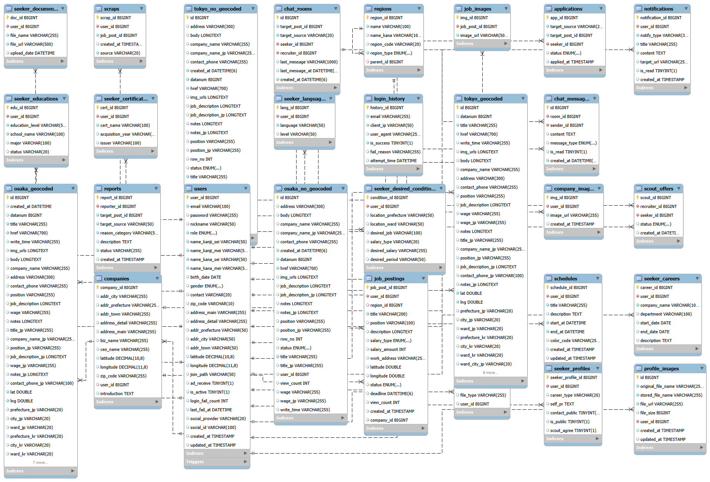
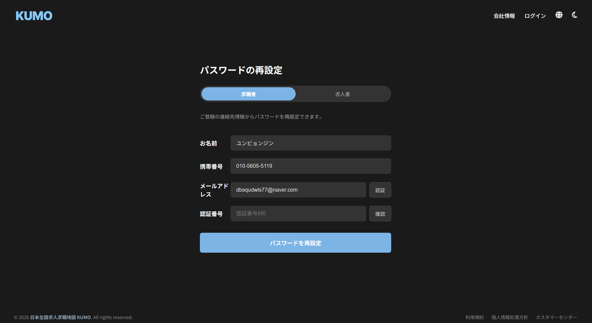
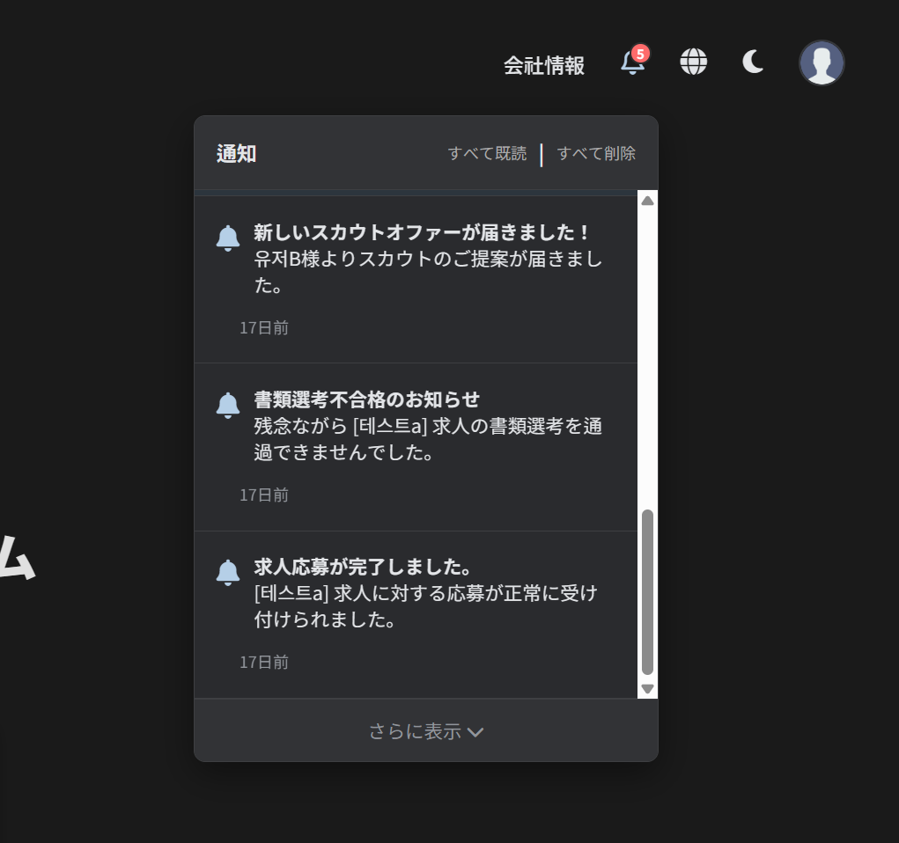

<div align="center">

[](https://git.io/typing-svg)

**地図基盤の日韓グローバル求人求職マッチングプラットフォーム**<br>
**지도 기반 한/일 글로벌 구인구직 매칭 플랫폼**

[]()
[]()
[]()
[]()
[]()
[]()
[]()

<br>

**[🇯🇵 日本語 (Japanese)](#-japanese-version)** | **[🇰🇷 한국어 (Korean)](#-korean-version)**

</div>

---

# 🇰🇷 Korean Version

## 📝 프로젝트 소개

| 항목 | 내용                               |
|------|----------------------------------|
| 프로젝트명 | KUMO（くも）                         |
| 개발 기간 | 2026년 1월16일 ~ 2026년 3월10일 (약 7주) |
| 팀 구성 | 5명 (리더로 참여)                      |
| 성과 | 프로젝트 콘테스트 **3위 입상**              |

**KUMO**는 일본(도쿄, 오사카) 지역의 구인구직 정보를 지도 위에서 한눈에 확인하고, 내 주변의 일자리를 손쉽게 탐색할 수 있는 **지도 기반 매칭 플랫폼**입니다.
한국어와 일본어를 동시 지원하며, 구직자와 구인자 간의 실시간 1:1 채팅 기능을 제공하여 빠른 소통을 돕습니다.

🎥 **[데모 영상 보기 (YouTube)](https://youtu.be/94VRuBHwwlk)**

<br>

## ✨ 주요 기능 (Key Features)

### 🗺️ 지도 기반 구인구직
- **Google Maps 연동:** 도쿄/오사카 지역 공고를 지도 위 마커로 표시하고, 줌 레벨에 따라 클러스터링 지원
- **GPS 기반 탐색:** 사용자 현재 위치를 기준으로 주변 공고 탐색
- **지오코딩:** 주소 입력 시 위도/경도로 변환하여 지도 마커 생성
- **공고 밀집도 시각화:** 특정 지역에 등록된 공고 수를 지도 위에서 직관적으로 확인 가능

### 🔍 공고 검색 & 관리
- **지역 전환 & 키워드 검색:** 도쿄/오사카 지역 구분 및 키워드 검색 지원
- **지도형 & 목록형 보기:** 사용자 선호에 따라 지도형 / 목록형 탐색 방식 제공
- **공고 CRUD:** 구인자가 공고 작성, 수정, 마감 처리 가능
- **이미지 업로드:** 공고 등록 시 이미지 첨부 지원
- **찜하기(Scrap):** 관심 공고 저장 및 스크랩한 공고 모아보기
- **최근 본 공고:** 사용자가 열람한 공고 이력 자동 저장

### 🔐 회원 & 인증
- **유형별 회원가입:** 구직자(Seeker) / 구인자(Recruiter) 분리 회원가입 지원
- **기업 회원 인증:** 구인자는 가입 시 증빙자료 첨부 필수
- **보안 인증:** Spring Security + BCrypt 기반 비밀번호 암호화, 로그인 5회 실패 시 reCAPTCHA 적용
- **ID 찾기:** 이름(성 + 이름) + 연락처로 확인
- **PW 찾기:** 이름 + 연락처 확인 후 이메일 인증 진행
- **프로필 관리:** 프로필 사진, 닉네임, 기업 정보 수정 지원

### 👔 구인자 전용 기능
- **채용 대시보드:** 지원자 수, 방문자 수 등 통계 데이터를 차트로 시각화
- **공고 관리:** 공고 작성, 수정, 마감 처리 및 이미지 업로드 지원
- **지원자 관리:** 공고별 지원자 목록 확인, 이력서 열람, 지원 상태(승인 / 거절) 변경
- **스카우트:** 이력서 공개 및 스카우트 수신에 동의한 구직자 목록을 확인하고 직접 스카우트 제의 가능
- **일정 관리:** FullCalendar 연동을 통한 면접 일정 등 캘린더 관리

### 👤 구직자 전용 기능
- **마이페이지:** 지원 현황, 활동 내역, 스카우트 제의 내역 통합 관리
- **이력서 관리:** 학력, 경력, 자격증, 언어 능력 등 상세 프로필 등록
- **공개 설정:** 이력서 공개 여부 및 스카우트 수신 여부 설정 가능 상황에 따라 연락처 공개/비공개도 가능
- **공고 지원:** 프로필 및 서류를 첨부하여 원하는 공고에 지원
- **스카우트 현황:** 구인자로부터 받은 스카우트 제의 리스트 확인 가능

### 💬 실시간 소통
- **1:1 채팅 (WebSocket/STOMP):** 공고 기반 구인자-구직자 간 실시간 채팅 지원
- **채팅 번역:** 번역 토글 버튼 클릭 시 한국어 ↔ 일본어 번역 전환 가능 (DeepL API)
- **파일 공유:** 채팅 내 이미지 및 문서 전송 지원
- **읽음 확인:** 메시지 읽음 / 안읽음 표시 및 채팅방 리스트 관리

### 🌐 다국어 & UI
- **한일 바이링걸 지원:** UI 및 공고 내용을 한국어 / 일본어로 전환 가능
- **다크모드 / 라이트모드:** 테마 전환 지원 및 페이지 이동 시 설정 유지
- **실시간 알림:** 지원, 스카우트, 합격 / 불합격, 지원 중인 공고 마감, 게시글 신고 접수 / 피신고 시 알림 제공

### 🛠️ 관리자 기능
- **관리자 대시보드:** 사용자 수, 신규 가입자, 신고 내역 등 운영 현황 모니터링
- **회원 관리:** 구인자 가입 승인, 유저 권한 및 계정 활성화 설정
- **신고 처리:** 허위 공고 신고 접수 및 블라인드 처리
- **사이트 통계:** 지역별 공고 현황 시각화
- **보안 로그:** 로그인 성공 / 실패 등 보안 내역 확인

<br>

## 👤 담당 기능 (ユン・ビョンジン)

> 5인 팀에서 **리더**를 맡아, 기획부터 설계·구현·테스트까지 아래 기능을 담당했습니다.

### 🔐 인증 · 보안

| 기능 | 구현 상세 |
|------|-----------|
| Spring Security 설정 | `SecurityFilterChain`으로 URL별 접근 제어 구현. 비로그인·구직자(`SEEKER`)·구인자(`RECRUITER`)·관리자(`ADMIN`) 역할별 접근 권한 분리 |
| 부정 로그인 대책 (reCAPTCHA) | `RecaptchaFilter`를 독자 구현하여 `UsernamePasswordAuthenticationFilter` 앞에 배치. 로그인 5회 실패 시 Google reCAPTCHA v2 인증을 강제 표시. 서버 사이드에서 Google API를 호출하여 토큰 검증 |
| Ajax 로그인 핸들러 | `AjaxAuthenticationSuccessHandler` / `FailureHandler`로 비동기 로그인 처리. 실패 시 failCount·showCaptcha 플래그를 JSON으로 반환하여 프론트에서 동적 UI 제어 |
| 로그인 이력 기록 | 모든 로그인 시도를 `LoginHistoryEntity`에 기록 (이메일, IP, User-Agent, 실패 사유). 프록시/로드밸런서 환경을 고려한 클라이언트 IP 추출 로직 포함 |
| 패스워드 리셋 | Java Mail Sender로 인증 메일 발송 → 이메일 인증 완료 후 비밀번호 변경 페이지로 이동하는 보안 워크플로우 구축 |
| 비밀번호 암호화 | `BCryptPasswordEncoder`로 패스워드 해싱 처리 |

### 🏠 비로그인 화면 전반

| 기능 | 구현 상세 |
|------|-----------|
| 홈 · 로그인 | 서비스 랜딩 페이지 및 Ajax 기반 로그인 화면 구현 |
| 회원가입 (구직자) | 기본 정보 입력 + 이메일 중복확인(Ajax) → 가입 즉시 활성화 |
| 회원가입 (구인자) | 기본 정보 + 사업 증명서류 첨부 → 가입 후 `isActive=false` 상태. Admin이 서류 확인 후 수동 승인하는 워크플로우 |
| ID 찾기 | 구직자/구인자 탭 분리, 이름 + 휴대번호로 이메일 검색 |
| PW 찾기 · 변경 | 이름 + 휴대번호 + 이메일 입력 → 이메일 인증 완료 후 PW 변경 페이지 이동 |

### 🌐 공통 UI

| 기능 | 구현 상세 |
|------|-----------|
| 다국어 토글 (한국어 ↔ 일본어) | `CookieLocaleResolver`(쿠키명: `lang`, 유효기간 1일) + `LocaleChangeInterceptor`로 URL 파라미터(`?lang=ko/ja`) 기반 언어 전환. `messages.properties` / `messages_ja.properties` 연동 |
| 다크모드 | `localStorage`에 테마 저장 → `body.dark-mode` 클래스 토글 → CSS 변수(`:root` vs `body.dark-mode`)로 색상 전환. 페이지 로드 시 FOUC(흰색 번쩍임) 방지를 위해 DOMContentLoaded 전 즉시 적용 처리 |

### 👤 구직자(Seeker) 기능

| 기능 | 구현 상세 |
|------|-----------|
| 이력서 관리 | `ResumeDto` 하나로 폼 전체를 수신 → `@Transactional` 내에서 기존 데이터 전체 삭제(delete) → flush → 7개 Entity에 신규 insert하는 전체 교체 방식으로 구현. 중간 실패 시 전체 롤백 보장. 연락처 공개 여부·이력서 공개 여부·스카우트 수신 동의 설정 포함 |
| 이력서 데이터 구조 | `UserEntity`를 중심으로 `SeekerProfileEntity`(1:1), `SeekerDesiredConditionEntity`(1:1), `SeekerCareerEntity`(1:N), `SeekerEducationEntity`(1:N), `SeekerCertificateEntity`(1:N), `SeekerLanguageEntity`(1:N), `SeekerDocumentEntity`(1:N) 연결 |
| 포트폴리오 파일 업로드 | `UUID + 원본 파일명`으로 로컬 저장 → DB에 파일 경로 기록 |
| 마이페이지 | 프로필 편집 |
| 스카우트 관리 | 구인자로부터의 스카우트 제안 수신 · 확인 · 응답 처리 |
| 지원 이력 | 구인 신청 이력 조회 및 진행 상태 확인 |

### 🔔 알림

| 기능 | 구현 상세 |
|------|-----------|
| 이벤트 기반 알림 시스템 | 비즈니스 로직 실행 시 서버 사이드에서 알림 데이터를 생성하여 DB에 저장. 페이지 로드 시 `/api/notifications/unread-count`를 호출하여 헤더 벨 아이콘 배지에 미읽음 수 표시. 사용자가 아이콘 클릭 시 `/api/notifications`로 알림 목록 조회. 각 알림에 타겟 URL을 저장하여 클릭 시 해당 페이지로 직접 이동 |
| 구직자 알림 이벤트 | ① 구인 신청 완료(`APP_COMPLETED`), ② 서류 합격(`APP_PASSED`), ③ 서류 불합격(`APP_FAILED`), ④ 스카우트 제의(`SCOUT_OFFER`), ⑤ 지원 중인 공고 마감(`JOB_CLOSED`) |
| 구인자 알림 이벤트 | ① 신규 지원자 접수(`NEW_APPLICANT`), ② 게시글 신고 접수(`REPORT_RESULT`) |
| 다국어 동적 변환 | DB에는 알림 타입 코드 + 타겟 URL만 저장. 조회 시 `MessageSource`를 통해 사용자 Locale에 맞는 문구를 실시간 생성하여 반환 |
| 읽음 처리 | PATCH `/api/notifications/read-all`로 `is_read` 상태 일괄 변경 |

### 🕷️ 데이터 수집 파이프라인

| 단계 | 구현 상세 |
|------|-----------|
| 1. 크롤링 | Selenium으로 다음 카페(동유모/오유모) 구인게시판에서 신규 게시글 수집. 기존 DB 최신 글 번호(`datanum`) 기준으로 신규만 크롤링 |
| 2. AI 파싱 | Gemini API(`gemini-2.5-flash`)로 비정형 게시글 본문을 정형 JSON(회사명, 주소, 연락처, 직무, 급여 등)으로 자동 추출. 429 에러 방어 재시도 로직 포함 |
| 3. 결측치 처리 | 회사명·주소 없는 데이터 삭제, 3단계 중복 도배글 제거 (제목 → 회사명+주소+연락처 → 회사명+주소) |
| 4. 지오코딩 | Google Maps Geocoding API로 주소 → 위도/경도 변환. 좌표 에러 행 자동 삭제 |
| 5. 지역 필터링 | 리버스 지오코딩으로 행정구역 추출 → 오사카시(도쿄 버전은 도쿄도) 데이터만 필터링. 한국어 구명(区名) 매핑 포함 |
| 6. 번역 | Gemini API로 한국어 데이터를 일본어로 일괄 번역 |
| 7. DB 저장 | MySQL `osaka_geocoded` / `tokyo_geocoded` 테이블에 INSERT. Admin 계정 자동 매핑 |

### 📋 PM 역할

| 항목 | 내용                                                                                |
|------|-----------------------------------------------------------------------------------|
| 진척 관리 | WBS 작성, 5명의 태스크 분담 및 진행 상황 관리. 7주간 프로젝트 완수                                        |
| Git 관리 | `feature/기능명` 브랜치 운용, PR 시 File Changes 확인 및 충돌 해결 후 병합 |
| 품질 관리 | 수동 테스트 반복 실시, 버그 발견 시 원인 추적 및 수정                                                              |
| 기술 지원 | 팀원의 구현 중 발생한 오류나 미해결 부분을 직접 수정·보완 |                                                  |

<br>

## 🏗️ 시스템 아키텍처


| 계층 | 설명 |
|------|------|
| **Spring Security & reCAPTCHA** | 모든 요청의 최전방에서 인증/인가를 처리하여 악의적 접근을 차단 |
| **Controller** | 사용자 요청을 수신하고 CookieLocaleResolver를 통해 한국어/일본어 UI를 동적 전환 |
| **Service Layer** | 12개의 서비스 클래스로 구성된 핵심 비즈니스 로직 계층. 구직자/구인자 관리, 공고 검색, 채팅(STOMP/WebSocket), 알림(이벤트 트리거 기반 REST API), 이메일 인증 등을 처리 |
| **JPA Repository** | Spring Data JPA를 통한 데이터 접근 계층. MySQL과의 상호작용을 추상화 |
| **Python Data Pipeline** | Selenium 크롤링 → pandas 정제 → Gemini AI 파싱/번역 → Google Maps 지오코딩 → 지역 필터링 → DB 적재까지 7단계 자동화 |

<br>

## 📊 ERD

### 핵심 테이블 구조



> 전체 ERD(28 테이블)는 [여기](docs/images/ERD1.png)에서 확인할 수 있습니다.
<br>

## 📁 프로젝트 구조

<details>
<summary>클릭하여 전체 구조 보기</summary>

```
src/main/java/net/kumo/kumo/
├── KumoApplication.java
├── config/
│   ├── LocaleConfig.java          # 다국어(i18n) 쿠키 기반 설정
│   ├── WebMvcConfig.java          # MVC 설정
│   └── WebSocketConfig.java       # WebSocket(STOMP) 설정
├── controller/                    # 16개 컨트롤러
│   ├── HomeController.java
│   ├── LoginController.java
│   ├── SeekerController.java
│   ├── RecruiterController.java
│   ├── AdminController.java
│   ├── MapController.java
│   ├── NotificationController.java
│   ├── ChatController.java
│   └── ...
├── domain/
│   ├── dto/                       # 30+ DTO
│   ├── entity/                    # 28+ Entity
│   └── enums/
├── security/
│   ├── WebSecurityConfig.java     # URL별 접근 권한 설정
│   ├── RecaptchaFilter.java       # reCAPTCHA 커스텀 필터
│   ├── AjaxAuthenticationSuccessHandler.java
│   ├── AjaxAuthenticationFailureHandler.java
│   └── AuthenticatedUserDetailsService.java
├── service/                       # 12개 서비스
├── repository/                    # 27개 리포지토리
├── exception/                     # 공통 예외 처리
└── util/
    ├── FileManager.java
    └── RecaptchaService.java

src/main/resources/
├── application.properties
├── messages.properties            # 한국어 메시지
├── messages_ja.properties         # 일본어 메시지
├── templates/
├── adminView/                 # 관리자 화면
├── AuthenticatedFragments/    # 인증 후 공통 프래그먼트
├── chat/                      # 채팅 화면
├── errorView/                 # 에러 페이지
├── fragments/                 # 채팅띄우기 화면
├── mainView/                  # 지도 메인 화면
├── mapView/                   # 지도 · 검색 화면
├── NonLoginFragments/         # 비로그인 공통 프래그먼트
├── NonLoginView/              # 비로그인 화면
├── recruiterView/             # 구인자 화면
├── SeekerView/                # 구직자 화면
└── home.html                  # 메인 홈
└── static/
    ├── css/
    ├── js/
    └── images/
```

</details>

<br>

## 📸 스크린샷

### 홈 화면


### 이메일 인증 (패스워드 재설정)


### 알림 기능


### 이력서 관리

<br>

## 📌 릴리즈 로드맵 (TODO List)

- [x] 🗺️ **지도 기본 기능 구현** (Google Maps 연동 및 마커 클러스터링)
- [x] 📱 **사이드바 / 바텀시트 UI 구현** (반응형 뷰 적용)
- [x] 📍 **내 주변 일자리 탐색** (GPS 기반 반경 필터링 완료)
- [x] 🔍 **검색 및 필터링** (지역/키워드 연동 검색 구현 완료)
- [x] ⭐ **최근 본 공고 및 찜하기(Scrap) 기능 구현**
- [x] 💬 **실시간 1:1 채팅 기능 도입**
- [x] 🌐 **한국어/일본어 다국어(i18n) 시스템 적용**
- [x] 🔔 알림 시스템 및 안읽은 메시지 뱃지 고도화
- [x] 🛠️ 통합 관리자(Admin) 대시보드 구축
- [x] 🤖 **데이터 수집 파이프라인 구축** (Selenium 크롤링 → Gemini AI 파싱/번역 → 지오코딩 → DB 적재 자동화)

<br>

## 👥 팀 구성 및 역할

| 이름 | 역할 | 담당 업무                                                  |
|------|------|--------------------------------------------------------|
| 윤병진 | 팀장 | 아키텍처 설계, 화면설계, 웹구축, Git 관리 , 데이터 수집 파이프라인 구축, 품질·일정 관리 |
| 김현우 | 팀원 | 웹 구축, 프레젠테이션, 문서 관리                                    |
| 황재연 | 팀원 | 화면 설계, 웹 구축, 기록 관리                                     |
| 이원우 | 팀원 | 화면 설계, 웹 구축, 데이터베이스 관리                                 |
| 함준우 | 팀원 | 화면 설계, 웹 구축, Git 관리                                    |

<br>
<br>

---

<br>

---
*Copyright © 2026 KUMO Project Team. All rights reserved.*
