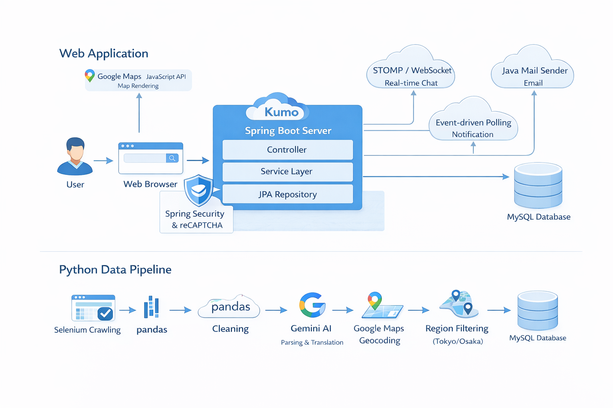
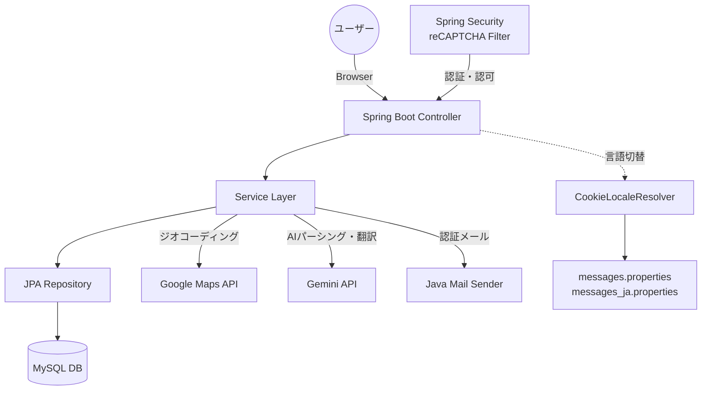
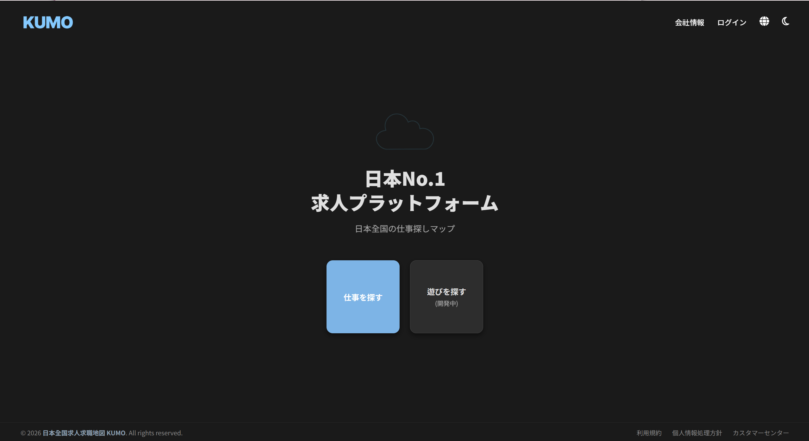
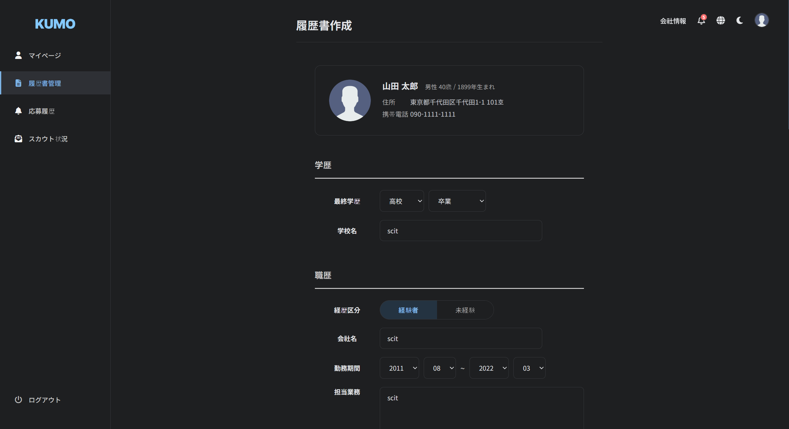
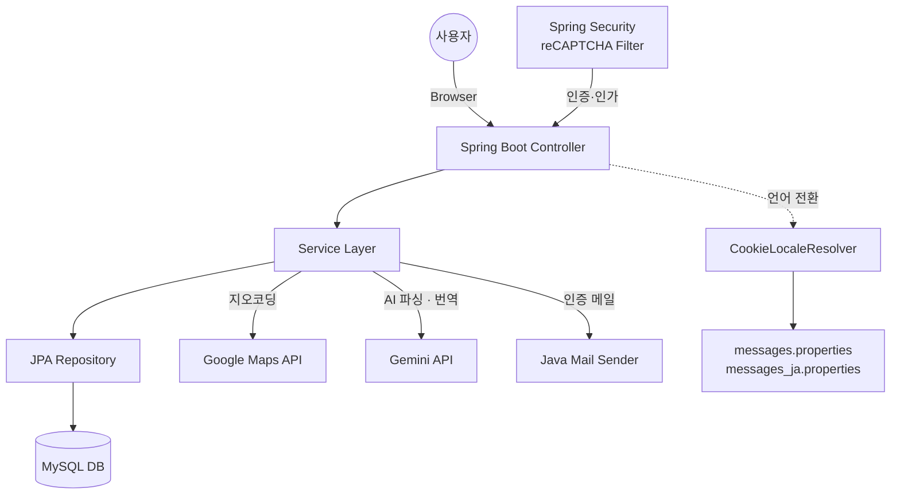

<div align="center">

[](https://git.io/typing-svg)

**地図基盤の日韓グローバル求人求職マッチングプラットフォーム**
**지도 기반 한/일 글로벌 구인구직 매칭 플랫폼**

[]()
[]()
[]()
[]()
[]()
[]()
[]()

<br>

**[🇯🇵 日本語 (Japanese)](#-japanese-version)** | **[🇰🇷 한국어 (Korean)](#-korean-version)**

</div>

---

<br>

# 🇯🇵 Japanese Version

## 📝 プロジェクト紹介

| 項目 | 内容 |
|------|------|
| プロジェクト名 | KUMO（くも） |
| 開発期間 | 2026年1月 〜 2026年3月（約7週間） |
| チーム構成 | 5名（リーダーとして参加） |
| 成果 | プロジェクトコンテスト **3位入賞** |

**KUMO**は、日本（東京・大阪）エリアの求人情報を地図上で一目で確認し、現在地周辺の求人を簡単に検索できる**地図基盤のマッチングプラットフォーム**です。
韓国語と日本語の同時サポートに加え、求職者と求人者間のリアルタイム1:1チャット機能を提供し、スムーズなコミュニケーションを支援します。

> 💡 **[デモ動画を見る（YouTube）](https://www.youtube.com/watch?v=ここにIDを入力)**

<br>

## ✨ 主要機能 (Key Features)

### 🗺️ スマートマップ検索
- **Google Maps連動＆クラスタリング:** 多数の求人情報を地図上で見やすくグループ化してレンダリング
- **GPS基盤の周辺検索:** 現在地を基準に半径内の求人をフィルタリング（東京・大阪エリア対応）

### 💼 カスタマイズ求人管理
- **多言語サポート:** ユーザーの設定に応じて韓国語(KR) / 日本語(JP)の求人内容およびUIを自動切り替え
- **ボトムシート＆フローティングカード:** 地図を移動しながら直感的に求人の要約情報を確認
- **最近見た求人＆お気に入り(Scrap):** 気になる求人をローカル/データベースに保存して一覧表示

### 💬 リアルタイムコミュニケーション＆管理
- **1:1 リアルタイムチャット (STOMP/WebSocket):** 求人ごとに求職者・求人者間のチャットルームを即時生成し対話
- **管理者クローリングデータの分離:** 独自登録の求人とシステム(Admin)収集求人を分離し、体系的にデータ管理
- **悪質求人の通報機能:** スパムや虚偽の求人をブロックするためのモーダルおよび通報受付システム

<br>

## 👤 担当機能 (ユン・ビョンジン)

> 5名のチームで**リーダー**を務め、企画から設計・実装・テストまで以下の機能を担当しました。

### 🔐 認証・セキュリティ

| 機能 | 実装詳細 |
|------|----------|
| Spring Security設定 | `SecurityFilterChain`によるURL別アクセス制御。非ログイン・求職者(`SEEKER`)・求人者(`RECRUITER`)・管理者(`ADMIN`)のロール別権限分離 |
| 不正ログイン対策 (reCAPTCHA) | `RecaptchaFilter`を独自実装し`UsernamePasswordAuthenticationFilter`の前に配置。ログイン5回失敗時にGoogle reCAPTCHA v2認証を強制表示。サーバーサイドでGoogle APIを呼び出しトークンを検証 |
| Ajaxログインハンドラー | `AjaxAuthenticationSuccessHandler` / `FailureHandler`による非同期ログイン処理。失敗時にfailCount・showCaptchaフラグをJSONで返却し、フロントで動的UI制御 |
| ログイン履歴記録 | 全てのログイン試行を`LoginHistoryEntity`に記録（メール、IP、User-Agent、失敗理由）。プロキシ・ロードバランサー環境を考慮したクライアントIP抽出ロジックを実装 |
| パスワードリセット | Java Mail Senderで認証メールを送信 → メール認証完了後にパスワード変更ページへ遷移するセキュリティワークフローを構築 |
| パスワード暗号化 | `BCryptPasswordEncoder`によるパスワードハッシュ化処理 |

### 🏠 非ログイン画面全般

| 機能 | 実装詳細 |
|------|----------|
| ホーム・ログイン | サービスランディングページおよびAjax基盤のログイン画面を実装 |
| 会員登録（求職者） | 基本情報入力 + メール重複確認（Ajax）→ 登録即時アクティブ化 |
| 会員登録（求人者） | 基本情報 + 事業証明書類添付 → 登録後`isActive=false`状態。Adminが書類確認後に手動承認するワークフロー |
| ID検索 | 求職者/求人者タブ分離、氏名 + 連絡先でメールアドレス検索 |
| PW検索・変更 | 氏名 + 連絡先 + メール入力 → メール認証完了後にPW変更ページへ遷移 |

### 🌐 共通UI

| 機能 | 実装詳細 |
|------|----------|
| 多言語トグル（韓国語 ↔ 日本語） | `CookieLocaleResolver`（Cookie名: `lang`、有効期間1日）+ `LocaleChangeInterceptor`によるURLパラメータ（`?lang=ko/ja`）基盤の言語切替。`messages.properties` / `messages_ja.properties`連動 |
| ダークモード | `localStorage`にテーマを保存 → `body.dark-mode`クラストグル → CSS変数（`:root` vs `body.dark-mode`）で配色切替。ページロード時のFOUC（白フラッシュ）防止のためDOMContentLoaded前に即時適用処理を実装 |

### 👤 求職者（Seeker）機能

| 機能 | 実装詳細 |
|------|----------|
| 履歴書管理 | `ResumeDto`一つでフォーム全体を受信 → `@Transactional`内で既存データの全削除（delete）→ flush → 7つのEntityに新規insertする全置換方式で実装。途中失敗時は全体ロールバック保証 |
| 履歴書データ構造 | `UserEntity`を中心に`SeekerProfileEntity`(1:1)、`SeekerDesiredConditionEntity`(1:1)、`SeekerCareerEntity`(1:N)、`SeekerEducationEntity`(1:N)、`SeekerCertificateEntity`(1:N)、`SeekerLanguageEntity`(1:N)、`SeekerDocumentEntity`(1:N)を連結 |
| ポートフォリオファイルアップロード | `UUID + 元ファイル名`でローカル保存 → DBにファイルパスを記録 |
| マイページ | プロフィール編集・公開設定・スカウト受信同意管理 |
| スカウト管理 | 求人者からのスカウト提案の受信・確認・応答処理 |
| 応募履歴 | 求人応募履歴の照会および進行状況確認 |

### 🔔 通知

| 機能 | 実装詳細 |
|------|----------|
| Polling方式リアルタイム通知 | フロントから定期的に`/api/notifications/unread-count`を呼び出し、未読数をヘッダーのベルアイコンバッジに表示 |
| 通知生成イベント | ① 求人応募完了 → 求職者に通知、② 新規応募者発生 → 求人者に通知、③ スカウト提案 → 求職者に通知 |
| 多言語動的変換 | DBには通知タイプコード + ターゲットURLのみ保存。照会時に`MessageSource`を通じてユーザーのLocaleに合わせた文言をリアルタイム生成して返却 |
| 既読処理 | PATCH `/api/notifications/read-all`で`is_read`状態を一括変更 |

### 🕷️ データ収集パイプライン

| ステップ | 実装詳細 |
|----------|----------|
| 1. クローリング | Seleniumでダウムカフェ（在日韓国人コミュニティ）の求人掲示板から新規投稿を収集。既存DB最新記事番号（`datanum`）基準で新規のみクローリング |
| 2. AIパーシング | Gemini API（`gemini-2.5-flash`）で非定型投稿本文を定型JSON（会社名、住所、連絡先、職務、給与等）に自動抽出。429エラー防御リトライロジック搭載 |
| 3. 欠損値処理 | 会社名・住所なしのデータ削除、3段階重複投稿除去（タイトル → 会社名+住所+連絡先 → 会社名+住所） |
| 4. ジオコーディング | Google Maps Geocoding APIで住所 → 緯度/経度変換。座標エラー行の自動削除 |
| 5. 地域フィルタリング | リバースジオコーディングで行政区域を抽出 → 大阪市（東京版は東京都）データのみフィルタリング。韓国語区名マッピング含む |
| 6. 翻訳 | Gemini APIで韓国語データを日本語に一括翻訳 |
| 7. DB保存 | MySQL `osaka_geocoded` / `tokyo_geocoded` テーブルにINSERT。Admin用アカウント自動マッピング |

### 📋 PM役割

| 項目 | 内容 |
|------|------|
| 進捗管理 | WBS作成、5名のタスク分担および進行状況管理。7週間でプロジェクト完遂 |
| Git戦略 | `feature/機能名`ブランチ戦略策定、コミットメッセージ規則（`[FEAT]`, `[FIX]`, `[REFACTOR]`, `[CHORE]`）運用 |
| 品質管理 | 手動テスト繰り返し実施、共通例外処理構造（`GlobalExceptionHandler`）構築 |
| 技術支援 | チームメンバー間の技術的ボトルネック（API連動等）解決支援 |

<br>

## 🏗️ システムアーキテクチャ

<!-- アーキテクチャ画像を docs/images/ に入れてパスを修正してください -->




<br>

## 🗄️ ER図

<!-- ER図画像を docs/images/ に入れてパスを修正してください -->


<br>

## 📁 プロジェクト構造

<details>
<summary>クリックして全体構造を表示</summary>

```
src/main/java/net/kumo/kumo/
├── KumoApplication.java
├── config/
│   ├── LocaleConfig.java          # 多言語(i18n) Cookie基盤設定
│   ├── WebMvcConfig.java          # MVC設定
│   └── WebSocketConfig.java       # WebSocket(STOMP)設定
├── controller/                    # 16コントローラー
│   ├── HomeController.java
│   ├── LoginController.java
│   ├── SeekerController.java
│   ├── RecruiterController.java
│   ├── AdminController.java
│   ├── MapController.java
│   ├── NotificationController.java
│   ├── ChatController.java
│   └── ...
├── domain/
│   ├── dto/                       # 30+ DTO
│   ├── entity/                    # 28+ Entity
│   └── enums/
├── security/
│   ├── WebSecurityConfig.java     # URL別アクセス権限設定
│   ├── RecaptchaFilter.java       # reCAPTCHAカスタムフィルター
│   ├── AjaxAuthenticationSuccessHandler.java
│   ├── AjaxAuthenticationFailureHandler.java
│   └── AuthenticatedUserDetailsService.java
├── service/                       # 12サービス
├── repository/                    # 27リポジトリ
├── exception/                     # 共通例外処理
└── util/
    ├── FileManager.java
    └── RecaptchaService.java

src/main/resources/
├── application.properties
├── messages.properties            # 韓国語メッセージ
├── messages_ja.properties         # 日本語メッセージ
├── templates/
│   ├── NonLoginView/              # 非ログイン画面
│   ├── SeekerView/                # 求職者画面
│   ├── mainView/recruiterView/    # 求人者画面
│   ├── adminView/                 # 管理者画面
│   ├── mapView/                   # 地図・検索画面
│   └── chat/                      # チャット画面
└── static/
    ├── css/
    ├── js/
    └── images/
```

</details>

<br>

## 📸 スクリーンショット

<!-- スクリーンショットを docs/images/ に入れてパスを修正してください -->

| ホーム画面 | 地図検索 |
|:---:|:---:|
|  |  |

| ログイン | 履歴書管理 |
|:---:|:---:|
|  |  |

<br>

## 📌 リリースロードマップ (TODO List)

- [x] 🗺️ **地図の基本機能実装** (Google Maps連動およびマーカークラスタリング)
- [x] 📱 **サイドバー / ボトムシートUI実装** (レスポンシブ対応)
- [x] 📍 **周辺の求人検索** (GPS基盤の半径フィルタリング完了)
- [x] 🔍 **検索およびフィルタリング** (地域・キーワード連動検索実装完了)
- [x] ⭐ **最近見た求人およびお気に入り(Scrap)機能実装**
- [x] 💬 **リアルタイム 1:1 チャット機能導入**
- [x] 🌐 **韓国語/日本語の多言語(i18n)システム適用**
- [x] 🔔 プッシュ通知システムおよび未読メッセージバッジの高度化
- [x] 🛠️ 統合管理者(Admin)ダッシュボード構築

<br>

## 🤝 協業ルール (Contributing)
円滑なチームプロジェクト進行のため、以下の事項を必ず守ってください！ 😊
1. **ブランチ(Branch)の作成:** 作業時は必ず `feature/機能名` の形式でブランチを作成してください。
2. **構造変更の事前共有:** データベースのテーブル構造(Entity)の変更や、コアロジック・共通コンポーネント(Header/Footer/BaseEntity)の修正・フォークを行う際は、**必ずチームメンバーに事前に共有**してください！ 🚨
3. **コミットメッセージのルール:** - `[FEAT]` : 新機能の追加 / `[FIX]` : バグ修正 / `[REFACTOR]` : リファクタリング / `[CHORE]` : 環境設定など

<br>

# 🇰🇷 Korean Version

## 📝 프로젝트 소개

| 항목 | 내용 |
|------|------|
| 프로젝트명 | KUMO（くも） |
| 개발 기간 | 2026년 1월 ~ 2026년 3월 (약 7주) |
| 팀 구성 | 5명 (리더로 참여) |
| 성과 | 프로젝트 콘테스트 **3위 입상** |

**KUMO**는 일본(도쿄, 오사카) 지역의 구인구직 정보를 지도 위에서 한눈에 확인하고, 내 주변의 일자리를 손쉽게 탐색할 수 있는 **지도 기반 매칭 플랫폼**입니다.
한국어와 일본어를 동시 지원하며, 구직자와 구인자 간의 실시간 1:1 채팅 기능을 제공하여 빠른 소통을 돕습니다.

> 💡 **[데모 영상을 보려면 여기를 클릭하세요 (YouTube)](https://www.youtube.com/watch?v=여기에ID입력)**

<br>

## ✨ 주요 기능 (Key Features)

### 🗺️ 스마트 맵 탐색
- **구글 맵 연동 & 클러스터링:** 수많은 공고를 맵 위에서 깔끔하게 그룹화하여 렌더링
- **GPS 기반 주변 탐색:** 내 위치를 기반으로 반경 내의 일자리 필터링 (도쿄/오사카 지역 완벽 지원)

### 💼 맞춤형 공고 관리
- **다국어 지원:** 사용자 설정에 따라 한국어(KR) / 일본어(JP) 공고 내용 및 UI 자동 변환
- **바텀시트 & 플로팅 카드:** 지도를 이동하며 직관적으로 공고 요약 정보 확인
- **최근 본 공고 & 찜하기(Scrap):** 관심 있는 공고를 로컬/DB에 저장하여 모아보기

### 💬 실시간 소통 및 관리
- **1:1 실시간 채팅 (STOMP/WebSocket):** 공고별로 구인자-구직자 간 즉각적인 채팅방 생성 및 대화
- **어드민 크롤링 데이터 분리:** 자체 등록 공고와 시스템(Admin) 수집 공고를 분리하여 체계적인 데이터 관리
- **악성 공고 신고 기능:** 스팸, 허위 매물 차단을 위한 모달 및 신고 접수 시스템

<br>

## 👤 담당 기능 (ユン・ビョンジン)

> 5인 팀에서 **리더**를 맡아, 기획부터 설계·구현·테스트까지 아래 기능을 담당했습니다.

### 🔐 인증 · 보안

| 기능 | 구현 상세 |
|------|-----------|
| Spring Security 설정 | `SecurityFilterChain`으로 URL별 접근 제어 구현. 비로그인·구직자(`SEEKER`)·구인자(`RECRUITER`)·관리자(`ADMIN`) 역할별 접근 권한 분리 |
| 부정 로그인 대책 (reCAPTCHA) | `RecaptchaFilter`를 독자 구현하여 `UsernamePasswordAuthenticationFilter` 앞에 배치. 로그인 5회 실패 시 Google reCAPTCHA v2 인증을 강제 표시. 서버 사이드에서 Google API를 호출하여 토큰 검증 |
| Ajax 로그인 핸들러 | `AjaxAuthenticationSuccessHandler` / `FailureHandler`로 비동기 로그인 처리. 실패 시 failCount·showCaptcha 플래그를 JSON으로 반환하여 프론트에서 동적 UI 제어 |
| 로그인 이력 기록 | 모든 로그인 시도를 `LoginHistoryEntity`에 기록 (이메일, IP, User-Agent, 실패 사유). 프록시/로드밸런서 환경을 고려한 클라이언트 IP 추출 로직 포함 |
| 패스워드 리셋 | Java Mail Sender로 인증 메일 발송 → 이메일 인증 완료 후 비밀번호 변경 페이지로 이동하는 보안 워크플로우 구축 |
| 비밀번호 암호화 | `BCryptPasswordEncoder`로 패스워드 해싱 처리 |

### 🏠 비로그인 화면 전반

| 기능 | 구현 상세 |
|------|-----------|
| 홈 · 로그인 | 서비스 랜딩 페이지 및 Ajax 기반 로그인 화면 구현 |
| 회원가입 (구직자) | 기본 정보 입력 + 이메일 중복확인(Ajax) → 가입 즉시 활성화 |
| 회원가입 (구인자) | 기본 정보 + 사업 증명서류 첨부 → 가입 후 `isActive=false` 상태. Admin이 서류 확인 후 수동 승인하는 워크플로우 |
| ID 찾기 | 구직자/구인자 탭 분리, 이름 + 휴대번호로 이메일 검색 |
| PW 찾기 · 변경 | 이름 + 휴대번호 + 이메일 입력 → 이메일 인증 완료 후 PW 변경 페이지 이동 |

### 🌐 공통 UI

| 기능 | 구현 상세 |
|------|-----------|
| 다국어 토글 (한국어 ↔ 일본어) | `CookieLocaleResolver`(쿠키명: `lang`, 유효기간 1일) + `LocaleChangeInterceptor`로 URL 파라미터(`?lang=ko/ja`) 기반 언어 전환. `messages.properties` / `messages_ja.properties` 연동 |
| 다크모드 | `localStorage`에 테마 저장 → `body.dark-mode` 클래스 토글 → CSS 변수(`:root` vs `body.dark-mode`)로 색상 전환. 페이지 로드 시 FOUC(흰색 번쩍임) 방지를 위해 DOMContentLoaded 전 즉시 적용 처리 |

### 👤 구직자(Seeker) 기능

| 기능 | 구현 상세 |
|------|-----------|
| 이력서 관리 | `ResumeDto` 하나로 폼 전체를 수신 → `@Transactional` 내에서 기존 데이터 전체 삭제(delete) → flush → 7개 Entity에 신규 insert하는 전체 교체 방식으로 구현. 중간 실패 시 전체 롤백 보장 |
| 이력서 데이터 구조 | `UserEntity`를 중심으로 `SeekerProfileEntity`(1:1), `SeekerDesiredConditionEntity`(1:1), `SeekerCareerEntity`(1:N), `SeekerEducationEntity`(1:N), `SeekerCertificateEntity`(1:N), `SeekerLanguageEntity`(1:N), `SeekerDocumentEntity`(1:N) 연결 |
| 포트폴리오 파일 업로드 | `UUID + 원본 파일명`으로 로컬 저장 → DB에 파일 경로 기록 |
| 마이페이지 | 프로필 편집 · 공개 설정 · 스카우트 수신 동의 관리 |
| 스카우트 관리 | 구인자로부터의 스카우트 제안 수신 · 확인 · 응답 처리 |
| 지원 이력 | 구인 신청 이력 조회 및 진행 상태 확인 |

### 🔔 알림

| 기능 | 구현 상세 |
|------|-----------|
| Polling 방식 실시간 알림 | 프론트에서 주기적으로 `/api/notifications/unread-count`를 호출하여 미읽음 개수를 헤더 벨 아이콘 배지에 표시 |
| 알림 생성 이벤트 | ① 구인 신청 완료 → 구직자에게 알림, ② 신규 지원자 발생 → 구인자에게 알림, ③ 스카우트 제의 → 구직자에게 알림 |
| 다국어 동적 변환 | DB에는 알림 타입 코드 + 타겟 URL만 저장. 조회 시 `MessageSource`를 통해 사용자 Locale에 맞는 문구를 실시간 생성하여 반환 |
| 읽음 처리 | PATCH `/api/notifications/read-all`로 `is_read` 상태 일괄 변경 |

### 🕷️ 데이터 수집 파이프라인

| 단계 | 구현 상세 |
|------|-----------|
| 1. 크롤링 | Selenium으로 다음 카페(동유모/오유모) 구인게시판에서 신규 게시글 수집. 기존 DB 최신 글 번호(`datanum`) 기준으로 신규만 크롤링 |
| 2. AI 파싱 | Gemini API(`gemini-2.5-flash`)로 비정형 게시글 본문을 정형 JSON(회사명, 주소, 연락처, 직무, 급여 등)으로 자동 추출. 429 에러 방어 재시도 로직 포함 |
| 3. 결측치 처리 | 회사명·주소 없는 데이터 삭제, 3단계 중복 도배글 제거 (제목 → 회사명+주소+연락처 → 회사명+주소) |
| 4. 지오코딩 | Google Maps Geocoding API로 주소 → 위도/경도 변환. 좌표 에러 행 자동 삭제 |
| 5. 지역 필터링 | 리버스 지오코딩으로 행정구역 추출 → 오사카시(도쿄 버전은 도쿄도) 데이터만 필터링. 한국어 구명(区名) 매핑 포함 |
| 6. 번역 | Gemini API로 한국어 데이터를 일본어로 일괄 번역 |
| 7. DB 저장 | MySQL `osaka_geocoded` / `tokyo_geocoded` 테이블에 INSERT. Admin 계정 자동 매핑 |

### 📋 PM 역할

| 항목 | 내용 |
|------|------|
| 진척 관리 | WBS 작성, 5명의 태스크 분담 및 진행 상황 관리. 7주간 프로젝트 완수 |
| Git 전략 | `feature/기능명` 브랜치 전략 수립, 커밋 메시지 규칙(`[FEAT]`, `[FIX]`, `[REFACTOR]`, `[CHORE]`) 운용 |
| 품질 관리 | 수동 테스트 반복 실시, 공통 예외 처리 구조(`GlobalExceptionHandler`) 구축 |
| 기술 지원 | 팀원 간 기술적 병목(API 연동 등) 해결 지원 |

<br>

## 🏗️ 시스템 아키텍처

<!-- 아키텍처 이미지를 docs/images/ 에 넣고 경로를 수정하세요 -->




<br>

## 🗄️ ER図

<!-- ERD 이미지를 docs/images/ 에 넣고 경로를 수정하세요 -->


<br>

## 📁 프로젝트 구조

<details>
<summary>클릭하여 전체 구조 보기</summary>

```
src/main/java/net/kumo/kumo/
├── KumoApplication.java
├── config/
│   ├── LocaleConfig.java          # 다국어(i18n) 쿠키 기반 설정
│   ├── WebMvcConfig.java          # MVC 설정
│   └── WebSocketConfig.java       # WebSocket(STOMP) 설정
├── controller/                    # 16개 컨트롤러
│   ├── HomeController.java
│   ├── LoginController.java
│   ├── SeekerController.java
│   ├── RecruiterController.java
│   ├── AdminController.java
│   ├── MapController.java
│   ├── NotificationController.java
│   ├── ChatController.java
│   └── ...
├── domain/
│   ├── dto/                       # 30+ DTO
│   ├── entity/                    # 28+ Entity
│   └── enums/
├── security/
│   ├── WebSecurityConfig.java     # URL별 접근 권한 설정
│   ├── RecaptchaFilter.java       # reCAPTCHA 커스텀 필터
│   ├── AjaxAuthenticationSuccessHandler.java
│   ├── AjaxAuthenticationFailureHandler.java
│   └── AuthenticatedUserDetailsService.java
├── service/                       # 12개 서비스
├── repository/                    # 27개 리포지토리
├── exception/                     # 공통 예외 처리
└── util/
    ├── FileManager.java
    └── RecaptchaService.java

src/main/resources/
├── application.properties
├── messages.properties            # 한국어 메시지
├── messages_ja.properties         # 일본어 메시지
├── templates/
│   ├── NonLoginView/              # 비로그인 화면
│   ├── SeekerView/                # 구직자 화면
│   ├── mainView/recruiterView/    # 구인자 화면
│   ├── adminView/                 # 관리자 화면
│   ├── mapView/                   # 지도 · 검색 화면
│   └── chat/                      # 채팅 화면
└── static/
    ├── css/
    ├── js/
    └── images/
```

</details>

<br>

## 📸 스크린샷

<!-- 스크린샷을 docs/images/ 에 넣고 경로를 수정하세요 -->

| 홈 화면 | 지도 검색 |
|:---:|:---:|
|  |  |

| 로그인 | 이력서 관리 |
|:---:|:---:|
|  |  |

<br>

## 📌 릴리즈 로드맵 (TODO List)

- [x] 🗺️ **지도 기본 기능 구현** (Google Maps 연동 및 마커 클러스터링)
- [x] 📱 **사이드바 / 바텀시트 UI 구현** (반응형 뷰 적용)
- [x] 📍 **내 주변 일자리 탐색** (GPS 기반 반경 필터링 완료)
- [x] 🔍 **검색 및 필터링** (지역/키워드 연동 검색 구현 완료)
- [x] ⭐ **최근 본 공고 및 찜하기(Scrap) 기능 구현**
- [x] 💬 **실시간 1:1 채팅 기능 도입**
- [x] 🌐 **한국어/일본어 다국어(i18n) 시스템 적용**
- [x] 🔔 알림(Push) 시스템 및 안읽은 메시지 뱃지 고도화
- [x] 🛠️ 통합 관리자(Admin) 대시보드 구축

<br>

## 🤝 협업 규칙 (Contributing)
원활한 팀 프로젝트 진행을 위해 아래 사항을 꼭 지켜주세요! 😊
1. **브랜치(Branch) 생성:** 작업 시 반드시 `feature/기능명` 형태로 브랜치를 파서 작업해 주세요.
2. **구조 변경 사전 공유:** 데이터베이스 테이블 구조(Entity)를 변경하거나, 핵심 로직 및 공통 컴포넌트(Header/Footer/BaseEntity)를 수정·포크 하실 때는 **반드시 팀원들에게 먼저 공유**해 주세요! 🚨
3. **커밋 메시지 규칙:** - `[FEAT]` : 새로운 기능 추가 / `[FIX]` : 버그 및 에러 수정 / `[REFACTOR]` : 코드 리팩토링 / `[CHORE]` : 환경설정 등

<br>
<br>

---

<br>

---
*Copyright © 2026 KUMO Project Team. All rights reserved.*
